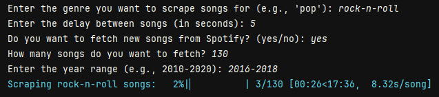
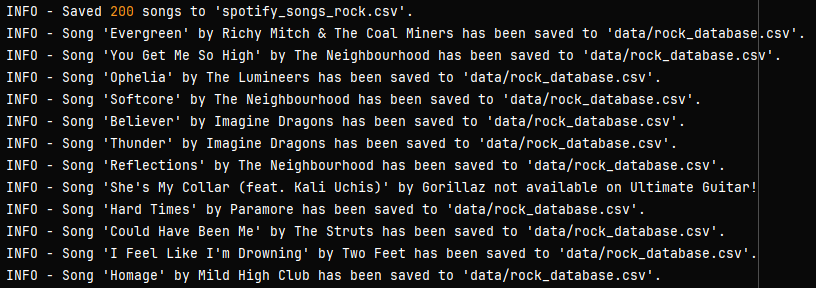
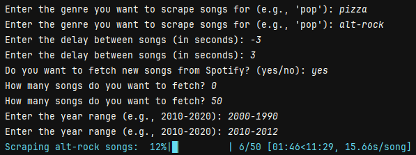
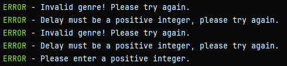

# TuneTracer

[](https://opensource.org/licenses/MIT)

## Overview

**TuneTracer** provides a set of tools to scrape chord progressions from the Ultimate Guitar website, transpose them to the key of C Major, and convert them to Roman numeral notation. This scraper uses the Spotify API to pull popular tracks and their key information, Selenium for web automation, and BeautifulSoup for HTML parsing.

## Features

- **Song Search**: Search for music by genre, year, and keyword.
- **Chord Transposition**: Transpose any song to the key of C.
- **Roman Numeral Conversion**: Convert chord progressions to Roman numeral notation.
- **Spotify Integration**: Fetch songs by genre using the Spotify API.


## Getting Started

### Prerequisites

- Python 3.x
- Selenium
- BeautifulSoup
- Spotipy (for Spotify integration)

### Installation and Setup

1. **Clone the Repository**
    ```sh
    git clone https://github.com/nicothemccoy/SpotiKey.git
    ```
2. **Install Dependencies**
    ```sh
    pip install -r requirements.txt
    ```

3. **Setup API Credentials (Optional)**

   - Navigate to [Spotify Developer Dashboard](https://developer.spotify.com/dashboard/)
   - Copy the Client ID and Client Secret.
   - Rename .env.example to .env and replace the placeholders with your API credentials.

4. **Run TuneTracer**
    ```
    python tuneTracer.py
    ```
   
## Usage

### Web Scraper

1. **Search for Music**:
   ```python
    from spotify_api import fetch_songs
    songs = fetch_songs(genre='rock', num_songs = '500', start_year='2012', end_year ='2016')
    ```
2. **Scrape Chord Progressions**:
    ```python
     from utilities import create_driver
     from web_scraper import search_songs, parse_chords
     driver = create_driver()
     search_songs(driver, song_name, artist)
     progressions = parse_chords(driver)
     ```
3. **Transpose to C Major**:
    ```python
    from utilities import create_driver
    from standardize import transposer
    from web_scraper import search_songs
    driver = create_driver()
    search_songs(driver, song_name, artist)
    transposed = transposer(driver, key, mode)
    ```
4. **Convert to Roman Numerals**:
    ```python
    from utilities import create_driver
    from standardize import convert_to_roman
    from web_scraper import search_songs, parse_chords
    driver = create_driver()
    search_songs(driver, song_name, artist)
    progressions = convert_to_roman(parse_chords(driver))
    ```

## Screenshots

### User Prompts


### Results Display


### Error Handling



## License

This project is licensed under the MIT License - see the [LICENSE](LICENSE.md) file for details.
